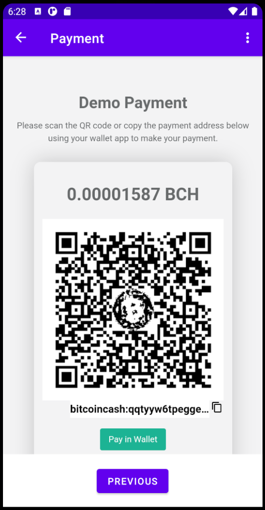

# androidDemo
Demonstration of prompt.cash integration into a simple android app.

## WebView integration
This demo consists of 3 simple view fragments:

1. [WelcomeFragment](app/src/main/java/com/example/promptcashdemo/WelcomeFragment.java): Ask the user for an amount to pay
using an input element.

2. [PaymentFragment](app/src/main/java/com/example/promptcashdemo/PaymentFragment.java): Opens the [Prompt.Cash](https://prompt.cash/)
gateway in a WebView and to let the user pay via QR code or BCH address.
It automatically detects payments by repeatedly evaluating the `window.promptCfg.payment.status` variable every second.

3. [CompletedFragment](app/src/main/java/com/example/promptcashdemo/CompletedFragment.java): The page that is shown to the user
after the payment has been completed.

## Running APK
There is an APK to run this demo on your android phone available in the [Release section](https://github.com/prompt-cash/androidDemo/releases).

## Contact
[Website](https://prompt.cash/) -
[Twitter](https://twitter.com/CashPrompt) -
[Telegram](https://t.me/PromptCash) -
[YouTube](https://www.youtube.com/channel/UClfNVdL3T0RF6pF1yGi9teg)
